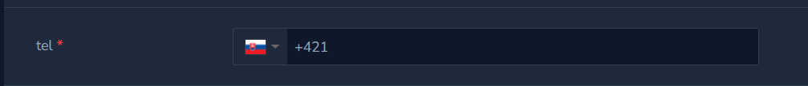

# Laravel Nova Tel Input





## Installation

``` php
composer require composer require pppcreative/tel-input
```

## Usage

``` php
use Ppp\TelInput\TelInput;

TelInput::make(__('cena'), 'price'),

TelInput::make('tel', 'title')->required()->rules('required')
    ->showDialCode(true)
    ->preferredCountries(['SK', 'CZ'])
    ->onlyCountries([]),
```

<a href="https://vue-tel-input.iamstevendao.com/">Vue Tel Input</a> for Laravel Nova

<a href="https://codesandbox.io/s/github/Sebastien-Pradines/vue_tel_input/tree/main/?file=/src/App.vue">Playground</a>


